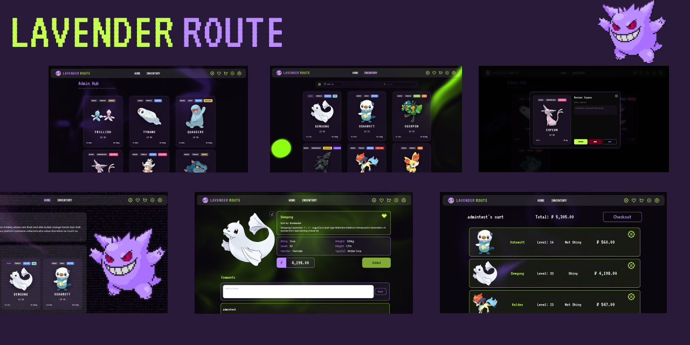
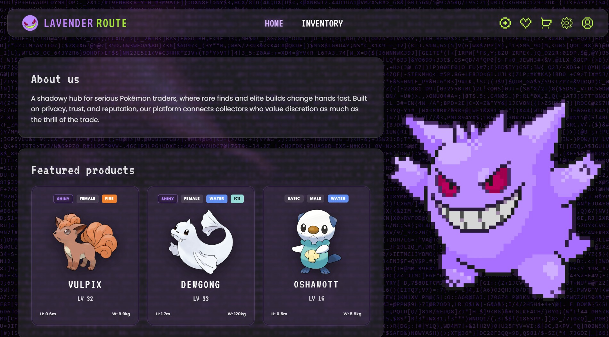
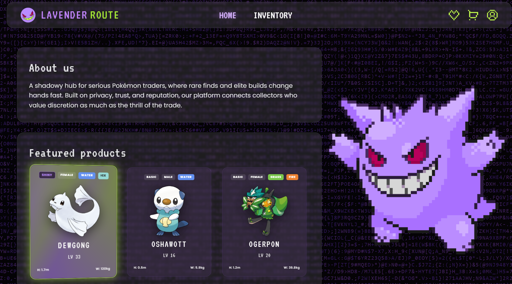
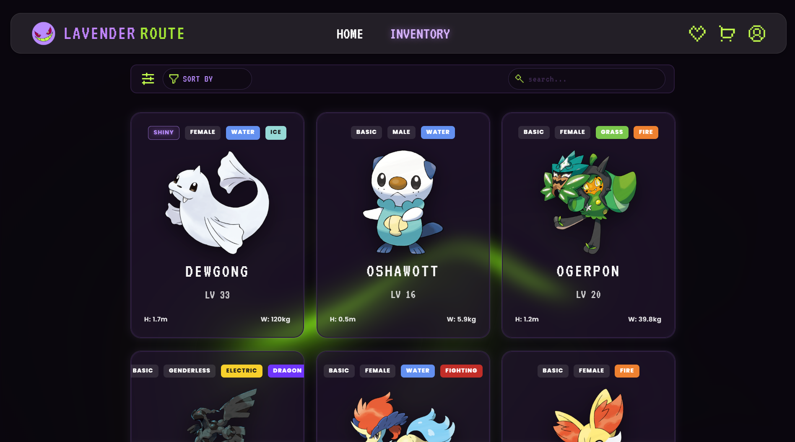
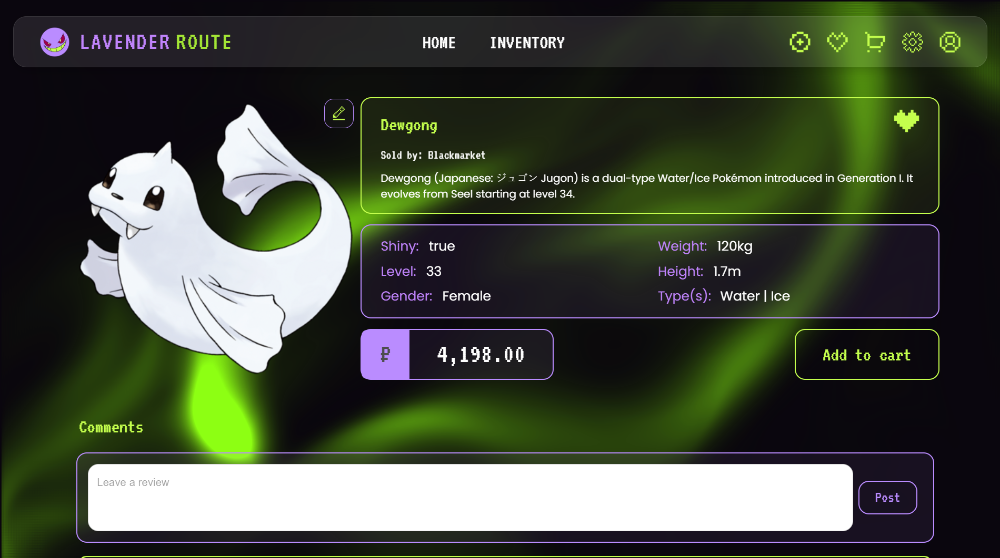
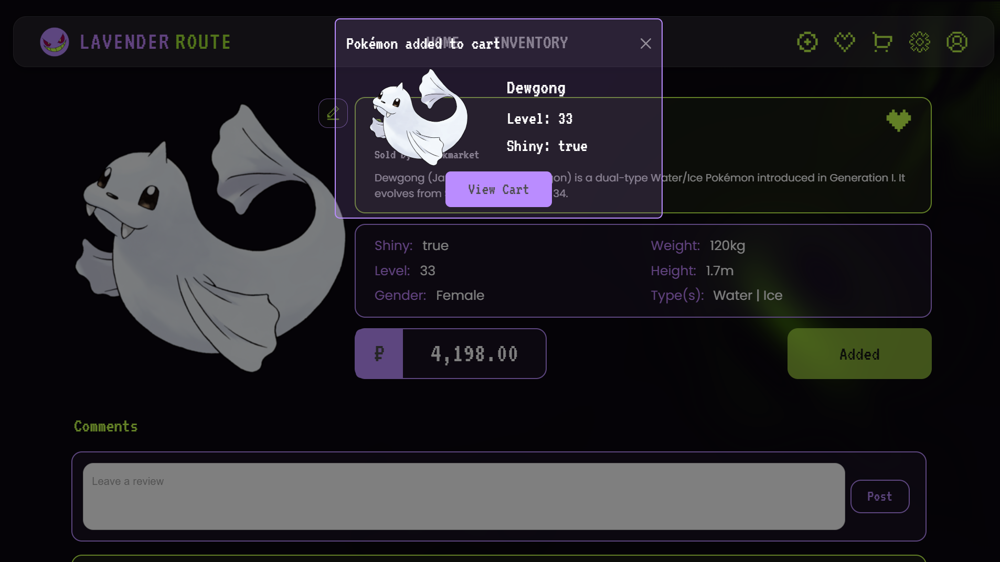
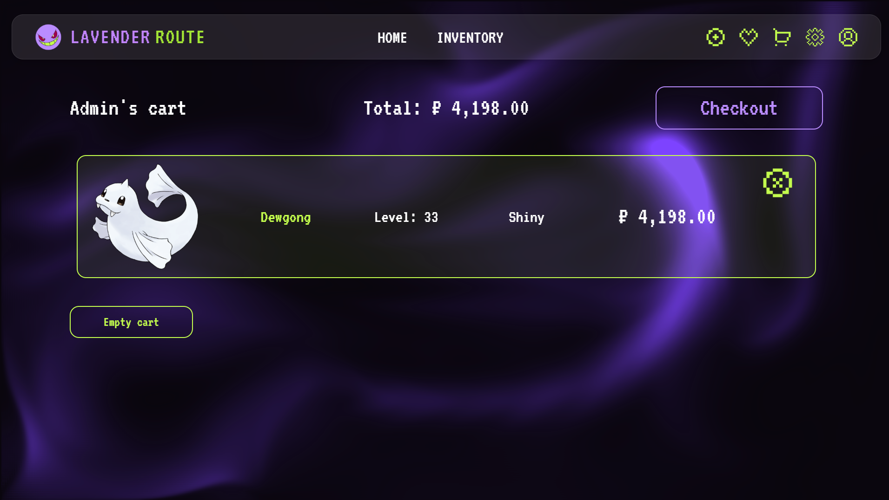
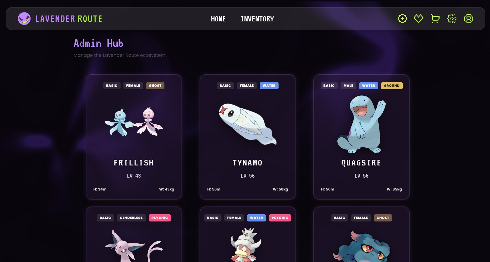
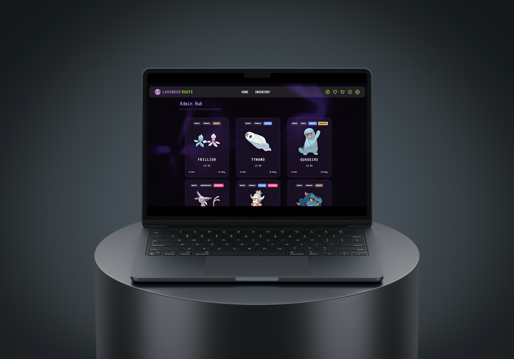

# Lavender Route



## Table of Contents

1. [About the Project](#1-about-the-project)
   - 1.1 [Project Description](#11-project-description)
   - 1.2 [Problem Statement](#12-problem-statement)
   - 1.3 [Built With](#13-built-with)
2. [Getting Started](#2-getting-started)
   - 2.1 [Prerequisites](#21-prerequisites)
   - 2.2 [How to Install](#22-how-to-install)
3. [Features and Usage](#3-features-and-usage)
   - [Screenshots & Explanations](#screenshots--explanations)
4. [Demonstration Video](#4-demonstration-video)
5. [Architecture / System Design](#5-architecture--system-design)
6. [Design Concept](#6-design-concept)
   - 6.1 [Mockups](#61-mockups)
7. [Highlights and Challenges](#7-highlights-and-challenges)
8. [Roadmap – Future Improvements](#8-roadmap--future-improvements)
9. [License](#9-license)
10. [Authors and Contact Info](#10-authors-and-contact-info)

---

## 1. About the Project

### 1.1 Project Description

**Lavender Route** is a full-stack MERN (MongoDB, Express.js, React, Node.js) application built as a specialised C2C (consumer-to-consumer) marketplace for trading Pokémon. It replaces the scattered, high-risk world of Discord servers and anonymous forum trades with a centralised, trust-first platform: users can securely register, list, browse, and buy Pokémon, backed by admin-reviewed listings, wishlists, cart checkout, and a comment/rating system that builds seller reputation over time.

The project name and gothic-cyberpunk visual identity are drawn from **Lavender Town** — the Pokémon games' famously eerie town, home to the Pokémon Tower — combined with the Gengar evolution line as mascot and logo. The result is a "Misty Glass" interface: dark, neon-lime-on-purple, and built for collectors who take their trades seriously.

The team used a modular development approach, with each developer taking ownership of a core area (authentication, database schema, catalog filtering, UI system) to keep execution consistent across the stack.

### 1.2 Problem Statement

Traditional high-value Pokémon trading happens across Discord channels, anonymous forums, and unstructured in-game trade requests. Finding a hyper-specific asset — an exact level, a particular gender, a rare Shiny variant — becomes a disorganised, needle-in-a-haystack search, and without a trusted middleman, traders are exposed to scams, asset theft, and identity spoofing.

**Lavender Route's solution** is a centralised MERN-stack trading ecosystem that replaces awkward forum searches with a modular, hyper-precise search and filter system, and replaces blind trust with a mandatory admin review step before any listing goes live — turning a high-risk private trade into a reliable, transparent marketplace transaction.

### 1.3 Built With

#### Frontend


#### Backend


#### Database


#### Design


---

## 2. Getting Started

### 2.1 Prerequisites

- [Node.js](https://nodejs.org/) and npm
- A MongoDB connection string (local instance or [MongoDB Atlas](https://www.mongodb.com/atlas))
- A code editor (e.g. VS Code)
- Git

### 2.2 How to Install

1. **Clone the Repository**

```bash
git clone https://github.com/RhichelleStrauss/LavenderRoute.git
cd LavenderRoute
```

2. **Set Up the Backend**

```bash
cd backend
npm install
```

Create a `.env` file inside `backend/` with:

```
MONGO_URI=your_mongodb_connection_string
JWT_SECRET_KEY=your_jwt_secret
```

Then start the server:

```bash
node server.js
```

The API will run on `http://localhost:5000`.

3. **Set Up the Frontend**

Open a new terminal:

```bash
cd frontend/LavendarRoute
npm install
npm run dev
```

4. **Run the Project**

Visit the app at the local URL printed by Vite (typically `http://localhost:5173`).

---

## 3. Features and Usage

- **Authentication & Identity**: Secure sign-up and login with JWT-based sessions and bcrypt password hashing. Users are typed as **Buyer**, **Seller**, or **Hybrid**, plus a separate **Admin** role, with Express middleware verifying tokens and roles on every protected route.
- **Admin-Reviewed Listings**: Sellers submit product listings that sit in a `pending` state until an admin approves or rejects them (with a note attached on rejection), keeping the catalog free of fraudulent or low-effort posts.
- **Hyper-Precise Search Matrix**: A live search bar combined with filter and sort logic narrows the catalog instantly by name, type, gender, level, and Shiny status, using normalised client-side string matching and an array comparator for sorting.
- **Catalog & Product Pages**: A responsive grid of Pokémon cards links through to a detailed product page showing full stats, seller info, and star ratings.
- **Cart & Wishlist**: Buyers can add listings to a cart with quantity selection for checkout, or save Pokémon to a wishlist to track before committing to a trade.
- **Social Trust Layer**: A commenting system lets buyers leave feedback directly on listings, building a visible reputation trail for sellers.
- **Admin Hub**: A dedicated management view for admins to oversee the full Pokémon catalog at a glance.
- **Misty Glass UI**: A dark, glassmorphic, neon-on-purple interface built with headless `@base-ui/react` components for full control over custom styling, animated backgrounds (React Bits' Liquid Ether / Letter Glitch), and a Gengar-inspired mascot and logo throughout.

### Screenshots & Explanations

**Home Page**

The landing page, featuring the animated Liquid Ether background, an About Us panel, and featured products pulled live from the catalog.



**Card Hover Effect**

Hovering a listing card triggers a glowing highlight border, with a stronger holo-foil sweep on Shiny Pokémon.



**Catalog Page**

The product grid with search, filter, and sort controls for narrowing results by type, gender, level, and Shiny status.



**Product Page**

The full detail view for a single listing: seller info, description, stats, price, and a comments section for buyer feedback.



**Add to Cart Modal**

Confirmation modal shown after adding a listing to the cart, with a direct link to view the cart.



**Cart Page**

The cart view showing added listings, running total, and checkout action.



**Admin Hub**

The admin's management view of the full Pokémon catalog, used to oversee and moderate listings across the platform.



---

## 4. Demonstration Video

[Watch the Lavender Route demo](https://drive.google.com/file/d/1dlkU7dZYCpsI-ePScZBGF3tXppFfiSH8/view?usp=sharing)

---

## 5. Architecture / System Design

- **Frontend**: Built with React and Vite. Renders the catalog, product, cart, wishlist, auth, and admin pages, and handles client-side search/filter/sort and cart state.
- **Backend**: Built with Node.js and Express, structured around an `Authentication` module (controllers, middleware, routes, User model) and a separate `Pokemon` route/model pair. Express middleware (`verifyToken`, `authRoles`) protects routes by JWT and by role.
- **Database**: MongoDB via Mongoose, storing two core collections — `User` and `Pokemon`.

#### Entity Relationship Overview

The schema is structured around the following core entities:

- **User** – `firstName`, `lastName`, `email`, `password` (hashed), `authPattern`, `roles` (`buyer` / `seller` / `admin`), `dob`, `adminPasskey`, `approvalStreak`, `denyStreak`, `isDeniedFromPosting`
- **Pokemon** – `name`, `shiny`, `description`, `height`, `weight`, `price`, `level`, `gender` (`Male` / `Female` / `Genderless`), `type` (up to 2 of 18 Pokémon types), `imagePokemon`, `status` (`pending` / `approved` / `rejected`), `adminNotes`, `sellerId` (ref → `User`), `comments` (embedded: `text`, `userName`)

Relationships: a `User` (as seller) **creates** `Pokemon` listings via `sellerId`, and any `User` may **comment** on a listing, with each comment embedded directly on the `Pokemon` document. An admin's review decision updates a listing's `status` and, on rejection, its `adminNotes`.

#### User Flows

The platform supports three distinct journeys:

- **Buyer Journey**: Browse the landing page or catalog → view basic listing details → log in or create an account to view full details → add to cart or wishlist → checkout.
- **Seller/Hybrid Journey**: Log in or create an account → submit a listing with full product details → wait for admin approval → if rejected, view the reason and resubmit; if approved, wait for a sale and receive payment.
- **Admin Journey**: Log in as admin → review the pending listings queue from the Admin Hub → approve (listing goes live) or deny (attach a reason, add a strike to the seller's account) → monitor comment activity and user reports, issuing strikes or bans as needed.

---

## 6. Design Concept

The visual identity is built around **Lavender Town** and the **Gengar evolution line** — the spookiest corner of the Pokémon world — reimagined as a sleek, secure trading platform rather than a haunted location.

**Color Palette**

| Purple (Primary) | Near-Black (Primary) | Lime (Primary) | Dark Grey (Secondary) |
|:---:|:---:|:---:|:---:|
| `#BA8CFF` | `#2A1A3A` | `#C4FF4D` | `#4D4D4D` |

**Fonts**

- **VT323** — headlines and navigation
- **Poppins** — body copy and subheadings

**Icons**

A minimal, lime-line icon set (filter, cart, account/profile) matching the neon-on-dark aesthetic; the full icon set was still being finalised during design.

### 6.1 Mockups

<div align="center">
  
  
</div>

---

## 7. Highlights and Challenges

### Highlights

- Designing a cohesive "Misty Glass" cyberpunk aesthetic from scratch, anchored in Lavender Town and the Gengar line, without relying on a standard component library's default look.
- Implementing a stateless, role-based authentication system with JWT and bcrypt, verified server-side on every protected route via Express middleware.
- Structuring an admin-review workflow directly into the data model, so a listing cannot go live without passing through `pending` → `approved`/`rejected`.
- Normalising the database by referencing `User` from `Pokemon` via `sellerId` and populating dynamically, rather than duplicating seller data across listings.

### Challenges

- **Full-stack security & RBAC.** Differentiating Admins, Sellers, and Buyers required more than hiding UI elements — the backend needed its own middleware (`verifyToken`, `authRoles`) to reject unauthorised requests regardless of what the frontend rendered.
- **NoSQL data modeling.** Deciding what to embed versus reference in MongoDB took iteration — comments are embedded directly on a `Pokemon` document for fast reads, while the seller relationship is a referenced `ObjectId` to keep listings lightweight and consistent.
- **Separation of concerns.** As the app grew, the backend was refactored into a clearer Authentication module (controllers/middleware/routes/models) separate from the Pokemon routes, and the frontend was broken into reusable components (cards, modals, forms) to avoid duplicated UI logic.
- **Custom theming without a heavy UI library.** Standard component libraries were too visually rigid for the glassmorphic look, so headless `@base-ui/react` components were used for accessible interaction logic while all styling was hand-built.

---

## 8. Roadmap – Future Improvements

- Real-time WebSocket support for live bidding and auctions.
- Direct messaging between buyers and sellers to negotiate trades safely.
- Advanced filtering by IVs, EVs, and specific abilities.
- Pokémon API integration for faster, more accurate listing creation.
- Expanded admin dashboard with user demographics and moderation history.

---

## 9. License

Distributed under the MIT License.

---

## 10. Authors and Contact Info

- **The Reactors** – Developer and Designer
